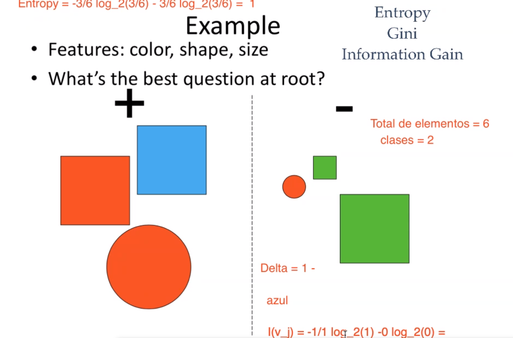

```{r pkgs, message=FALSE, warning=FALSE}
library(tidyverse)
```

# Measures for selecting the best split

$$
\begin{aligned}
\operatorname{Entropy}(t) &=-\sum_{i=0}^{c-1} p(i \mid t) \log _{2} p(i \mid t) \\
\operatorname{Gini}(t) &=1-\sum_{i=0}^{c-1}[p(i \mid t)]^{2} \\
\text { Classification error }(t) &=1-\max _{i}[p(i \mid t)]
\end{aligned}
$$
Donde $c$ es el número de clases. Escribiendo una función en **R** para calcular las tres medidas de impureza:

```{r impurity-measures}
impurity <- function(df, y_var){
  imp <- df %>% 
    group_by(!!sym(y_var)) %>% 
    summarise(n = n(), .groups = "drop") %>% 
    pull(n)
  t <- sum(imp)
  tibble(entropy =-sum(imp/t * if_else(is.infinite(log2(imp/t)),0,log2(imp/t))),
         gini = 1 - sum((imp/t)^2),
         `classification error` = 1 - max(imp/t) 
         )
}
```

# Ejemplos

## Ejemplo 1
$$
\begin{aligned}
&\begin{array}{|c|c|}
\hline \text { Node } N_{1} & \text { Count } \\
\hline \text { Clitss }=0 & 0 \\
\hline \text { Class }=1 & 6 \\
\hline
\end{array}\\
&\begin{array}{|c|c|}
\hline \text { Node } N_{2} & \text { Count } \\
\hline \text { Class }=0 & 1 \\
\hline \text { Class }=1 & 5 \\
\hline
\end{array}\\
&\begin{array}{|c|c|}
\hline \text { Node } N_{3} & \text { Count } \\
\hline \text { Class }=0 & 3 \\
\hline \text { Class }=1 & 3 \\
\hline
\end{array}
\end{aligned}
$$


```{r, eval = FALSE}
nodos <- tibble(n1 = c(0,6),
                n2 = c(1,5),
                n3 = c(3,3))
nodos %>% 
  map_df(impurity) %>% 
  mutate(nodo = names(nodos)) %>% 
  select(nodo, everything())
```

### Information gain

$$
\Delta=I(\text { parent })-\sum_{j=1}^{k} \frac{N\left(v_{j}\right)}{N} I\left(v_{j}\right)
$$

where $I(.)$ is the impurity measure of a given node. $N$ is the total number of records at the parent node, $k$ is the number of attribute values, and $N(v_j)$ is the number of records associated with the child node, $v_j$.

La función definida en **R** para calcular el **information gain**:

```{r information-gain}
gain <- function(df, y_var, feature, impurity_fun = c("entropy","gini","classification error")){
  N_v_j <- c()
  v_j <- c()
  features <- df %>% distinct(!!sym(feature)) %>% 
                      pull(!!sym(feature))
  
  parent_impurity <- impurity(df, y_var = y_var) %>% 
    pull(!!sym(impurity_fun))
  # parent_impurity <- df %>%
  #   group_by(!!sym(y_var)) %>%
  #   summarise(n = n(), .groups = "drop") %>%
  #   pull(n) %>%
  #   impurity() %>% pull(!!sym(impurity_fun))

  for (i in seq_along(features)) {
    df2 <- df %>% 
      filter(!!sym(feature) == features[i])
    
    N_v_j[i] <- df2 %>%
        group_by(!!sym(y_var), !!sym(feature)) %>%
        summarise(n = n(), .groups = "drop") %>%
        pull(n) %>% sum()
    
    v_j[i] <- 
      sum(
      # N(v_j)
         df2 %>%
        group_by(!!sym(y_var), !!sym(feature)) %>%
        summarise(n = n(), .groups = "drop") %>%
        pull(n) /
      # N
        df2 %>%
        group_by(!!sym(feature)) %>%
        summarise(n = n(), .groups = "drop") %>%
        pull(n) *
      # child nodes entropy
        impurity(df2,y_var = y_var) %>% 
        pull(!!sym(impurity_fun))
        
      # df2 %>%
      #   group_by(!!sym(y_var)) %>%
      #   summarise(n = n(), .groups = "drop") %>%
      #   pull(n) %>%
      #   impurity() %>% pull(!!sym(impurity_fun))
      )
    
  }
  
  return(parent_impurity - sum(N_v_j/nrow(df) * v_j))
}

gain_comparison <- 
  function(df, y_var, features, 
           impurity_fun = c("entropy", 
                            "gini",
                            "classification error")) {
  feats <- df %>% select(all_of(features)) %>% names()
  info_gain <- feats %>%
    map_dbl(gain, df = df, y_var = y_var,
            impurity_fun = impurity_fun)
  
  names(info_gain) <- feats
  
  return(info_gain)
    
}
```


## Ejemplo 2




```{r}
# La entropía
impurity(c(3,3)) %>% 
  pull(entropy)
# Total de elementos y clases
t <- 6
clases <- 2 # las clases + ^ -
example2 <- tibble(clase = c(1,1,1,
                             2,2,2),
                   color = c("blue","red","red",
                             "green","red","green"),
                   size = c("big","big","big",
                            "small","small", "big"),
                   shape = c("square", "square", "circle",
                             "square", "circle", "square")
                   )
example2
# Delta
# azul
example2 %>% filter(color == "blue")
```

Se necesita calcular la entropía y coeficiente de Gini, para posteriormente calcular el **Information Gain**.

La impureza para el nodo raíz:

```{r}
example2 %>% 
  group_by(clase) %>% 
  summarise(n = n(), .groups = "drop") %>% 
  pull(n) %>% 
  impurity()
```


* Azul

$$
I(v_j) =- \frac{1}{1} \log_2(1) - 0\log_2(0) = 0
$$

* Rojo
```{r}
-2/3 * log2(2/3)-1/3*log2(1/3)
```
$$
I(v_j) =- \frac{2}{3} \log_2(2/3) - \frac{1}{3}  \log_2(\frac{1}{3}) = 0.9182958
$$

* Verde

$$
I(v_j) =- \frac{2}{2} \log_2(1) - 0/2 \log_2(0/2) = 0
$$

$$
\Delta = 1 - \left(\frac1 6 * 0 + \frac3 6 * 0.9182958 + \frac2 6 * 0 \right) = 0.5408
$$


El *information gain* para el **color**, utilizando como función de impureza la entropía.

```{r}
gain(example2, y_var = "clase", "color", "entropy")
```

Comparando la ganancia de información de los atributos:

```{r}
gain_comparison(example2, y_var = "clase", features = c("color","shape","size"), "entropy")
```

Así, el mejor atributo para el primer nodo sería **color**, puesto que tiene la mayor ganancia de información.

## Ejemplo Titanic

Vemos cuál es el mejor atributo para el primer nodo:

```{r}
gain_comparison(ptitanic, y_var = "survived", features = c("pclass","sex","sibsp","parch"), impurity_fun = "entropy")
```

Resulta ser **sex**.

Vemos sus medidas de impureza:

```{r}
impurity(ptitanic, "survived")
```
Vemos sus medidas de impureza para los nodos hijos

```{r}
ptitanic %>% 
  split(.$sex) %>% 
  map_df(impurity, y_var = "survived")
```

```{r}
ptitanic %>% 
  split(.$sex) %>% 
  map_df(impurity, y_var = "survived")
```

## Ejemplo: `weatherPlay`

```{r}
library(partykit)
data("WeatherPlay", package = "partykit")
summary(WeatherPlay)
```

```{r}
gain_comparison(WeatherPlay, y_var = "play",
                features = c("windy","outlook"),impurity_fun = "entropy")
```

```{r}
weather_tree <- decision_tree(cost_complexity = 0.001) %>%
  set_engine("rpart") %>%
  set_mode("classification") %>% 
  translate()
weather_tree
```

```{r}
weather_tree_fit <- weather_tree %>% 
  fit(play ~ ., data = WeatherPlay)
weather_tree_fit
```

```{r}
rpart::plotcp(weather_tree_fit$fit)
```

```{r}
rpart.plot(weather_tree_fit$fit, type = 4,roundint=FALSE)
```


